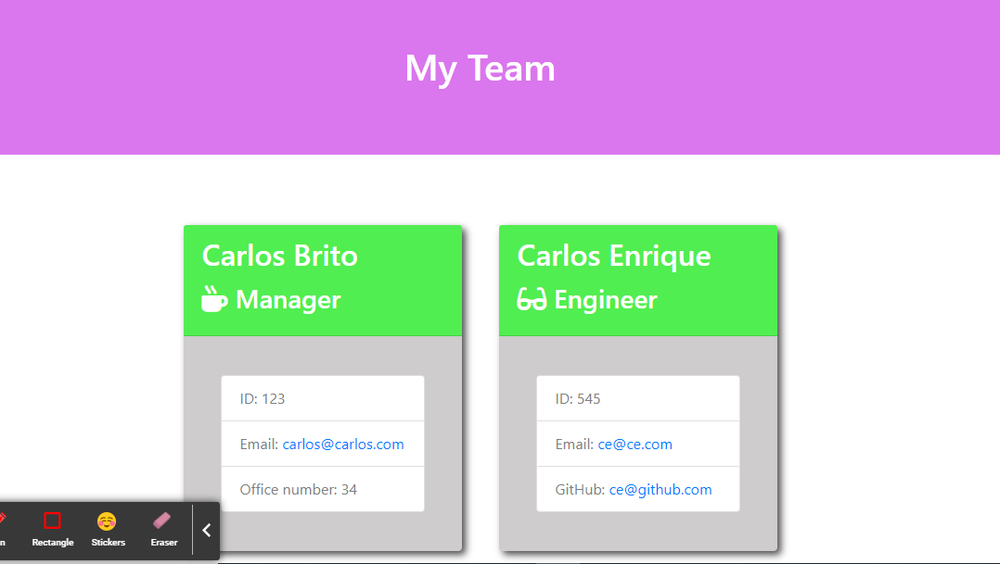

# P8-Team-Profile-Generator

## App Description
This node app will allow you to create a team directly from the terminal with the base information of name, email and ID

## Screenshot

## Using the app
### Starting the app
First you'll have to pop your terminal and run node index.js command

### Answering the Questions
A list of questions will appear for the user to answer and that will get the data to use to create the website.

### Creating the Website
Once you have answered all the questions, an HTML will appear with all your team so that you can visualize it on the web

### Tests
In case you want to run tests regarding the classes, you would only need to run the command and the tests will be applied to the app

## Link Video
https://drive.google.com/file/d/1YifCivUzrSYOp0TWXkl4pHR13eycJvuD/view?usp=sharing